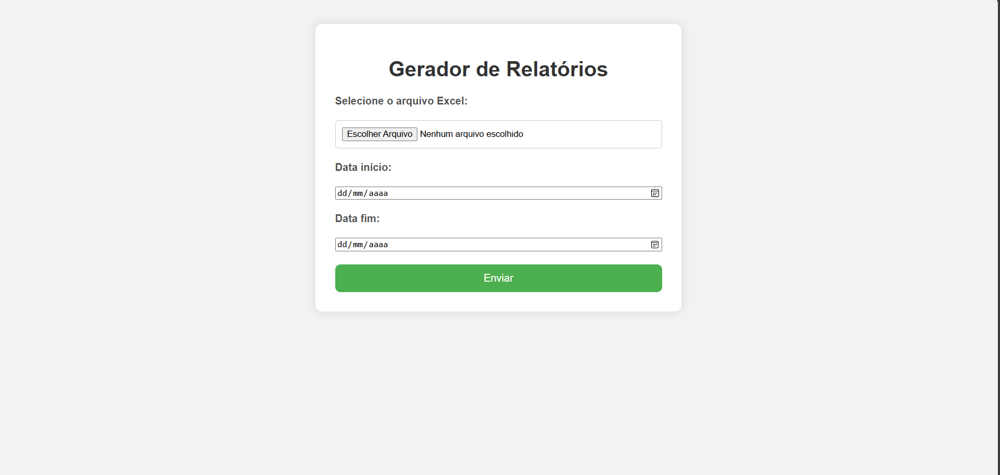
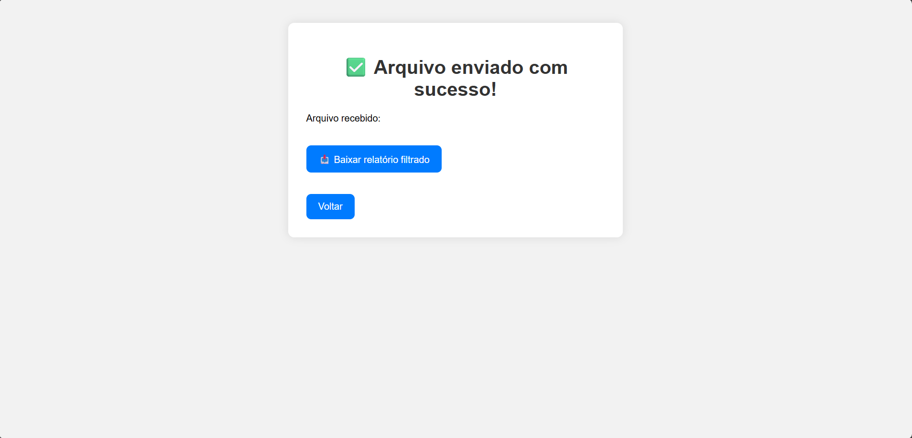

# Gerador de Relatórios a partir de Planilhas Excel

Ferramenta web feita com Flask + Python que permite:

- Fazer upload de arquivos Excel  
- Aplicar filtros de data (início e fim)  
- Ordenar dados automaticamente  
- Gerar um novo Excel filtrado e pronto para download

## Tecnologias utilizadas
- Python 3
- Flask
- Pandas
- HTML/CSS

## Demostração

## Como usar

1. Clone este repositório
2. Instale as dependências com `pip install -r requirements.txt`
3. Execute o projeto: `python app.py`
4. Acesse `http://localhost:5000` no navegador

---
> Este projeto pode ser adaptado para diferentes modelos de planilha.
